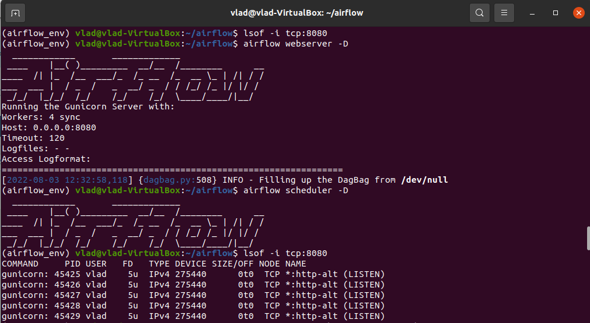
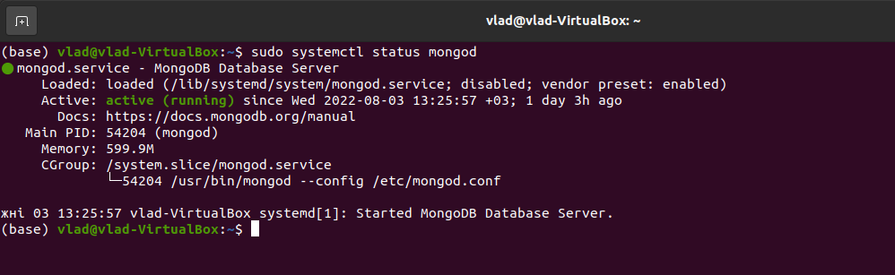
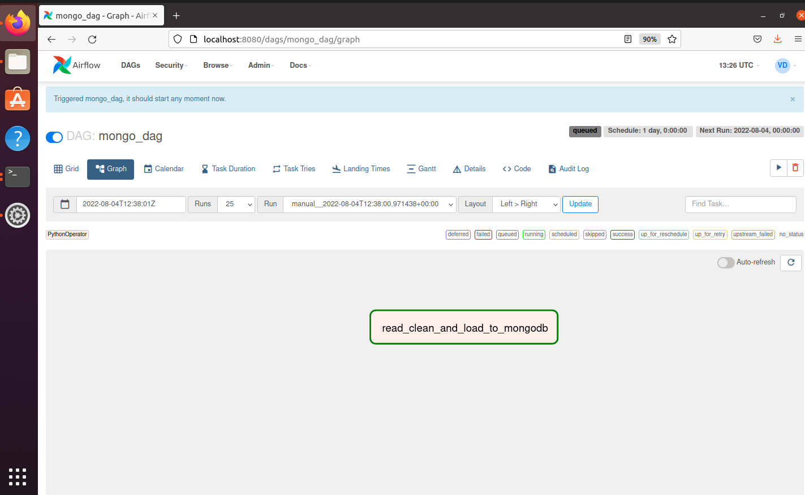

# Task 5. Airflow

To start airflow

```shell
airflow webserver -D
airflow scheduler -D
```



To start mongodb

```shell
sudo systemctl start mongod
```



Code for dag

```python
from airflow.models import Variable
from airflow.operators.python import PythonOperator
import pandas as pd
from airflow.utils.dates import days_ago
from airflow import DAG
import re
from airflow.providers.mongo.hooks.mongo import MongoHook

EMOJI_PATTERN = re.compile(r'[^\!\"\#\$\%\&\'\(\)\*\+\,\-\.\/\:\;\<\=\>\?\@\[\\\]\^\`\{\|\}\~\w \n]+')
MONGO_CONNECTION_STRING = 'airflow_mongodb'
FILE_PATH = Variable.get('file_path')
MONGO_COLLECTION = 'reviews'
MONGO_DB = 'tiktok_reviews'

mongo_dag = DAG(
    "mongo_dag",
    start_date=days_ago(0, 0, 0, 0, 0)
)


def read_clean_and_load(ti):
    raw_df = pd.read_csv(FILE_PATH)
    clean_df = raw_df.dropna(how='all').fillna('-')
    clean_df[['content']] = clean_df[['content']].replace(EMOJI_PATTERN, '')

    sorted_df = clean_df.sort_values(by=['at'])

    hook = MongoHook(MONGO_CONNECTION_STRING)
    hook.insert_many(mongo_collection=MONGO_COLLECTION, docs=sorted_df.to_dict('records'), mongo_db=MONGO_DB)


read_clean_and_load_to_mongodb = PythonOperator(
    task_id='read_clean_and_load_to_mongodb',
    python_callable=read_clean_and_load,
    dag=mongo_dag
)

read_clean_and_load_to_mongodb
```



### MongoDB queries

1. Top 5 famous commentaries

```shell
db.reviews.find({},{_id : 0}).sort({"thumbsUpCount" : -1}).limit(5).pretty()
```

Result

```json
{
  "reviewId": "gp:AOqpTOG0p6vXAtIgMvpxtBEvk9t_7yCj57K0P11C_lcVAEHo2K5URLkLaciK9gEdIZGOqiLOR4VrFx2-g2bCAw",
  "userName": "Courtney Ruppe",
  "userImage": "https://play-lh.googleusercontent.com/a-/AOh14Gh12HhWwzRiVgDITLfMA8A-oIsIQBPT4CQpVJHIpA",
  "content": "I love TikTok. However, I've recently had a lot of issues. First, I couldn't use all the filters. I kept getting notifications that the filter couldn't be used on my phone. I can use them all now, but now the captions are messed up. Other reviews say the captions don't show up at all, but I get double captions! It's infuriating. I've tried turning them off under accessibility, but that does nothing.",
  "score": 3,
  "thumbsUpCount": 20102,
  "reviewCreatedVersion": "23.6.4",
  "at": "2022-03-15 03:26:07",
  "replyContent": "-",
  "repliedAt": "-"
}
{
  "reviewId": "gp:AOqpTOHZUY_dy6hR28D1t79CaWttsFb2irK0nnY_Hp0V-CsKdoRq641LcH5OcnniYLv4lxiRa0sBFbjhcSEAKg",
  "userName": "Radeesh Jeikar",
  "userImage": "https://play-lh.googleusercontent.com/a-/AOh14GibkXq3D-zeH4xhc7Zp6uu-JxYapBNcIIjdBtVEcw",
  "content": "faxing didn't break any kind of TikTok cummunty guidelines I think someone peoples flagged my videos please review my account again and fix it as soon as possible",
  "score": 1,
  "thumbsUpCount": 11380,
  "reviewCreatedVersion": "22.9.3",
  "at": "2022-01-18 23:55:37",
  "replyContent": "-",
  "repliedAt": "-"
}
{
  "reviewId": "gp:AOqpTOF71SwG5arJ3Avp4wJubTdvxapkYfew8qyPCIhpPQzkc10SFfex9KYSHho1FVQfPndVnbiJj-J2FXn-SQ",
  "userName": "Patricia Beard",
  "userImage": "https://play-lh.googleusercontent.com/a-/AOh14Ghahi6_Cn941UZvvsEr8vaiZH7KnuhWBg21dj8Xxw",
  "content": "Honestly the best app ever created. I love the content. BUT ever since it's updated the videos are slow, the sound carries over from the last video played and keeps replaying, you swipe for the next video and it doesn't play, the lives get stuck on one motion pic. I've restarted my phone, quit the app but I believe it's the app it's self acting weird. I'm not liking it right now.",
  "score": 1,
  "thumbsUpCount": 11030,
  "reviewCreatedVersion": "23.7.2",
  "at": "2022-03-17 17:07:21",
  "replyContent": "-",
  "repliedAt": "-"
}
{
  "reviewId": "gp:AOqpTOG0tXCEVQiHO9fr9od5zo5sIvEk3m9ilYn3w7oI5HIMHq3-XF8XAI_ywmup0GJutx7nxD-XsKntoXjDYA",
  "userName": "Safdar khral",
  "userImage": "https://play-lh.googleusercontent.com/a-/AOh14GhL3QMXzJ8YO2QKbHzcvywWe_lkBkq5KOT9KLPcng",
  "content": "The app is fun as heck. Many videos give a unique perspective about love, sex, about stress about women about the male perspective. Then there are even political and cop discussions that go on in the comment section. And a lot of the animal videos are fascinating and heartwarming to watch. It's a creative site that keeps changing with new interesting videos added almost every second!",
  "score": 5,
  "thumbsUpCount": 10298,
  "reviewCreatedVersion": "23.3.4",
  "at": "2022-03-01 09:32:11",
  "replyContent": "-",
  "repliedAt": "-"
}
{
  "reviewId": "gp:AOqpTOE46ME3TZPk3KsHVA_56zbZgIf7PyE83GbWYO0R21tmE-9RG_aNV3Pfx8aWi_Lp-6aa1fhdUySq3tkHyA",
  "userName": "A Google user",
  "userImage": "https://play-lh.googleusercontent.com/EGemoI2NTXmTsBVtJqk8jxF9rh8ApRWfsIMQSt2uE4OcpQqbFu7f7NbTK05lx80nuSijCz7sc3a277R67g",
  "content": "I have reported many times people being very racist and or making fun of my religion, Muslim religion yet this app does not look into it says its not against the guidelines this is sent immediately after I complain. So its OK to make fun of my prophet and its fine? Does not surprise me. Pick and choose what you want to do. You should treat everyone the same.",
  "score": 1,
  "thumbsUpCount": 10206,
  "reviewCreatedVersion": "23.0.5",
  "at": "2022-01-26 21:30:06",
  "replyContent": "-",
  "repliedAt": "-"
}
```

2. All records, where length of field “content” is less than 5 characters

```shell
db.reviews.find({$expr : { $lt : [{$strLenCP : '$content'}, 5]}}).pretty()
```

Result

```json
{
  "_id": ObjectId(
  "62eba252d9ff4ccaddff1ac6"
  ),
  "reviewId": "gp:AOqpTOFOKOxBKWDbUjaoQml2UEqeVgQkcZ84CAPnb6QhkhAr4ZPzN7Uk-LEFPiadIkyIdTbTyDPJD68_rnHZKw",
  "userName": "OmoAkinola Survey Consult",
  "userImage": "https://play-lh.googleusercontent.com/a-/AOh14GgZoAE7MUU4S-mtwNnYxmOv0AKj_N7qShN2Pn6v",
  "content": "Cool",
  "score": 5,
  "thumbsUpCount": 0,
  "reviewCreatedVersion": "22.4.5",
  "at": "2022-01-17 10:46:27",
  "replyContent": "-",
  "repliedAt": "-"
}
{
  "_id": ObjectId(
  "62eba252d9ff4ccaddff1ac7"
  ),
  "reviewId": "gp:AOqpTOHLfvI7OYaoZS7MfhKmAxhzO2e54givQyufirtFYxMTAAW5S2_L1Ye_jrVXhRUQAc5MHqpywG8ahMTO0w",
  "userName": "S R",
  "userImage": "https://play-lh.googleusercontent.com/a-/AOh14GjlWnl7eU-O-5vj-GpNH68L91Uh50yK4qcUGXIM",
  "content": "Best",
  "score": 5,
  "thumbsUpCount": 0,
  "reviewCreatedVersion": "-",
  "at": "2022-01-17 10:46:40",
  "replyContent": "-",
  "repliedAt": "-"
}
{
  "_id": ObjectId(
  "62eba252d9ff4ccaddff1acd"
  ),
  "reviewId": "gp:AOqpTOHTMZ5SKFjBKouf9AAlILutA9cpvcTIq-HuIKJ2zkEgoToIANqxMrKrpIdjqhnO4j-9_CRqiq0w4RY_XQ",
  "userName": "Mizan Maji",
  "userImage": "https://play-lh.googleusercontent.com/a/AATXAJzSTlQPRX27O4syQ4e7h9g0Rxl9BLLyiz14Ewnm=mo",
  "content": "good",
  "score": 5,
  "thumbsUpCount": 0,
  "reviewCreatedVersion": "22.9.3",
  "at": "2022-01-17 10:48:11",
  "replyContent": "-",
  "repliedAt": "-"
}
{
  "_id": ObjectId(
  "62eba252d9ff4ccaddff1acf"
  ),
  "reviewId": "gp:AOqpTOG7hv26rf5IRdVqaayphCINMgUx97Ejn1s93KnkaunWPGo3BowzfCaaJdcRQkc2n5xMg-9g-tx-gUbOHw",
  "userName": "shehan VLOGS",
  "userImage": "https://play-lh.googleusercontent.com/a-/AOh14GhJMI5EwcwgE48FbJoPPxR62fstZzUUIsXR-FBZVA",
  "content": "Good",
  "score": 1,
  "thumbsUpCount": 0,
  "reviewCreatedVersion": "22.8.4",
  "at": "2022-01-17 10:48:38",
  "replyContent": "-",
  "repliedAt": "-"
}
```

And number of such comments

```shell
db.reviews.find({$expr: { $lt:[{$strLenCP: '$content' }, 5]}}).count()
```

Result

```shell
51793
```

3. Avarage rating by each day (should be in timestamp type)

```shell
db.reviews.aggregate([
  {$group : 
    {
      "_id" : {$substr : ["$at", 0, 10]}, 
      "avg_score" : {$avg: "$score"}
    } 
  }, 
  {$sort : {"_id" : 1}}
  ]).pretty()
```

Result

```json
{ "_id" : "2022-01-17", "avg_score" : 4.359368143922773 }
{ "_id" : "2022-01-18", "avg_score" : 4.316648531011969 }
{ "_id" : "2022-01-19", "avg_score" : 4.333502152443657 }
{ "_id" : "2022-01-20", "avg_score" : 4.337206365243748 }
{ "_id" : "2022-01-21", "avg_score" : 4.378759648655842 }
{ "_id" : "2022-01-22", "avg_score" : 4.337181337181337 }
{ "_id" : "2022-01-23", "avg_score" : 4.298110566829951 }
{ "_id" : "2022-01-24", "avg_score" : 4.323939808481533 }
{ "_id" : "2022-01-25", "avg_score" : 4.305135951661631 }
{ "_id" : "2022-01-26", "avg_score" : 4.330061693774537 }
{ "_id" : "2022-01-27", "avg_score" : 4.323398328690808 }
{ "_id" : "2022-01-28", "avg_score" : 4.355549358616844 }
{ "_id" : "2022-01-29", "avg_score" : 4.309254498714653 }
{ "_id" : "2022-01-30", "avg_score" : 4.320466321243523 }
{ "_id" : "2022-01-31", "avg_score" : 4.262430126507796 }
{ "_id" : "2022-02-01", "avg_score" : 4.32960235640648 }
{ "_id" : "2022-02-02", "avg_score" : 4.306634787806336 }
{ "_id" : "2022-02-03", "avg_score" : 4.2972027972027975 }
{ "_id" : "2022-02-04", "avg_score" : 4.3203450327186195 }
{ "_id" : "2022-02-05", "avg_score" : 4.318132464712269 }
{ "_id" : "2022-02-06", "avg_score" : 4.304404824331411 }
{ "_id" : "2022-02-07", "avg_score" : 4.334180790960452 }
{ "_id" : "2022-02-08", "avg_score" : 4.317391304347826 }
{ "_id" : "2022-02-09", "avg_score" : 4.296213183730715 }
{ "_id" : "2022-02-10", "avg_score" : 4.2653118825853795 }
{ "_id" : "2022-02-11", "avg_score" : 4.285469107551488 }
{ "_id" : "2022-02-12", "avg_score" : 4.2902367650971005 }
{ "_id" : "2022-02-13", "avg_score" : 4.28053053053053 }
{ "_id" : "2022-02-14", "avg_score" : 4.322316555488174 }
{ "_id" : "2022-02-15", "avg_score" : 4.343069716175255 }
{ "_id" : "2022-02-16", "avg_score" : 4.267809319764328 }
{ "_id" : "2022-02-17", "avg_score" : 4.2981501632208925 }
{ "_id" : "2022-02-18", "avg_score" : 4.322865554465162 }
{ "_id" : "2022-02-19", "avg_score" : 4.355322695879972 }
{ "_id" : "2022-02-20", "avg_score" : 4.354783459750428 }
{ "_id" : "2022-02-21", "avg_score" : 4.302151075537769 }
{ "_id" : "2022-02-22", "avg_score" : 4.29270166453265 }
{ "_id" : "2022-02-23", "avg_score" : 4.282554671968191 }
{ "_id" : "2022-02-24", "avg_score" : 4.343116883116883 }
{ "_id" : "2022-02-25", "avg_score" : 4.320529801324503 }
{ "_id" : "2022-02-26", "avg_score" : 4.298309178743962 }
{ "_id" : "2022-02-27", "avg_score" : 4.279498699456136 }
{ "_id" : "2022-02-28", "avg_score" : 4.2766515621273555 }
{ "_id" : "2022-03-01", "avg_score" : 4.342850818946436 }
{ "_id" : "2022-03-02", "avg_score" : 4.355896226415094 }
{ "_id" : "2022-03-03", "avg_score" : 4.33760075865339 }
{ "_id" : "2022-03-04", "avg_score" : 4.349529003470501 }
{ "_id" : "2022-03-05", "avg_score" : 4.308592835401545 }
{ "_id" : "2022-03-06", "avg_score" : 4.270112254443405 }
{ "_id" : "2022-03-07", "avg_score" : 4.2020623618954085 }
{ "_id" : "2022-03-08", "avg_score" : 4.306001481847369 }
{ "_id" : "2022-03-09", "avg_score" : 4.319959110656785 }
{ "_id" : "2022-03-10", "avg_score" : 4.098718557190318 }
{ "_id" : "2022-03-11", "avg_score" : 4.316598360655738 }
{ "_id" : "2022-03-12", "avg_score" : 4.344724770642202 }
{ "_id" : "2022-03-13", "avg_score" : 4.31335952848723 }
{ "_id" : "2022-03-14", "avg_score" : 4.289981972701519 }
{ "_id" : "2022-03-15", "avg_score" : 4.296471827277514 }
{ "_id" : "2022-03-16", "avg_score" : 4.319715340010543 }
{ "_id" : "2022-03-17", "avg_score" : 4.294638694638695 }
{ "_id" : "2022-03-18", "avg_score" : 4.30287859824781 }
{ "_id" : "2022-03-19", "avg_score" : 4.281387181738367 }
{ "_id" : "2022-03-20", "avg_score" : 4.306182310469314 }
{ "_id" : "2022-03-21", "avg_score" : 4.384937238493724 }
{ "_id" : "2022-03-22", "avg_score" : 4.355066771406127 }
{ "_id" : "2022-03-23", "avg_score" : 4.297648211660951 }
{ "_id" : "2022-03-24", "avg_score" : 4.257533552798177 }
{ "_id" : "2022-03-25", "avg_score" : 4.245377311344328 }
{ "_id" : "2022-03-26", "avg_score" : 4.3132730732635585 }
{ "_id" : "2022-03-27", "avg_score" : 4.32252641690682 }
{ "_id" : "2022-03-28", "avg_score" : 4.310774946921444 }
{ "_id" : "2022-03-29", "avg_score" : 4.2869808679421375 }
{ "_id" : "2022-03-30", "avg_score" : 4.288270377733598 }
{ "_id" : "2022-03-31", "avg_score" : 4.318956611570248 }
{ "_id" : "2022-04-01", "avg_score" : 4.300151591712987 }
{ "_id" : "2022-04-02", "avg_score" : 4.243452232476927 }
{ "_id" : "2022-04-03", "avg_score" : 4.28901449987712 }
{ "_id" : "2022-04-04", "avg_score" : 4.283013622463164 }
{ "_id" : "2022-04-05", "avg_score" : 4.260761589403973 }
```

To see full results check /results directory